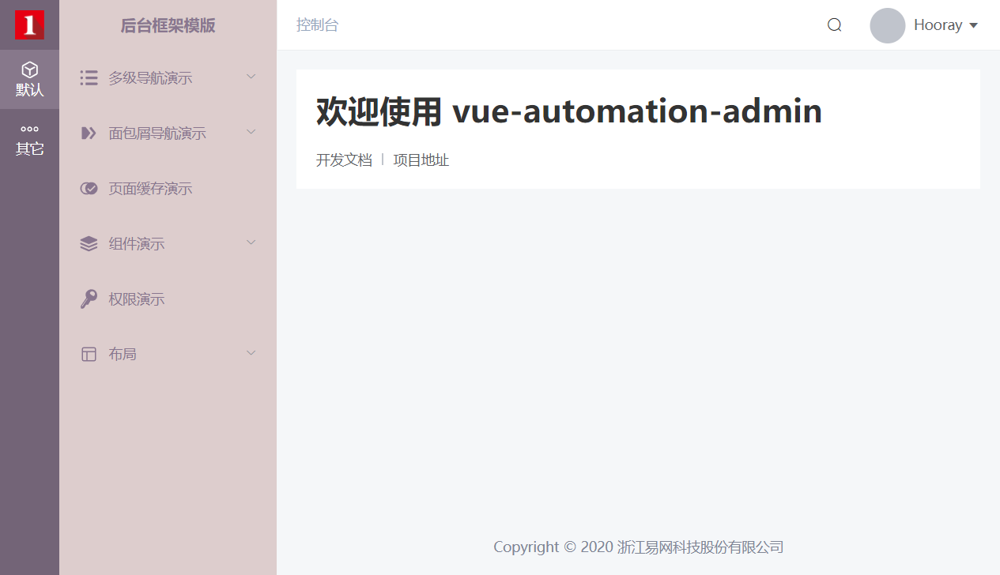
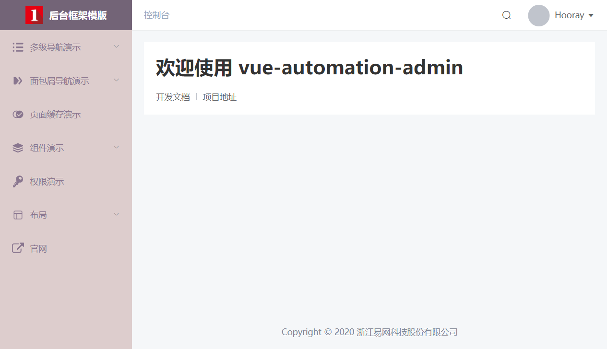
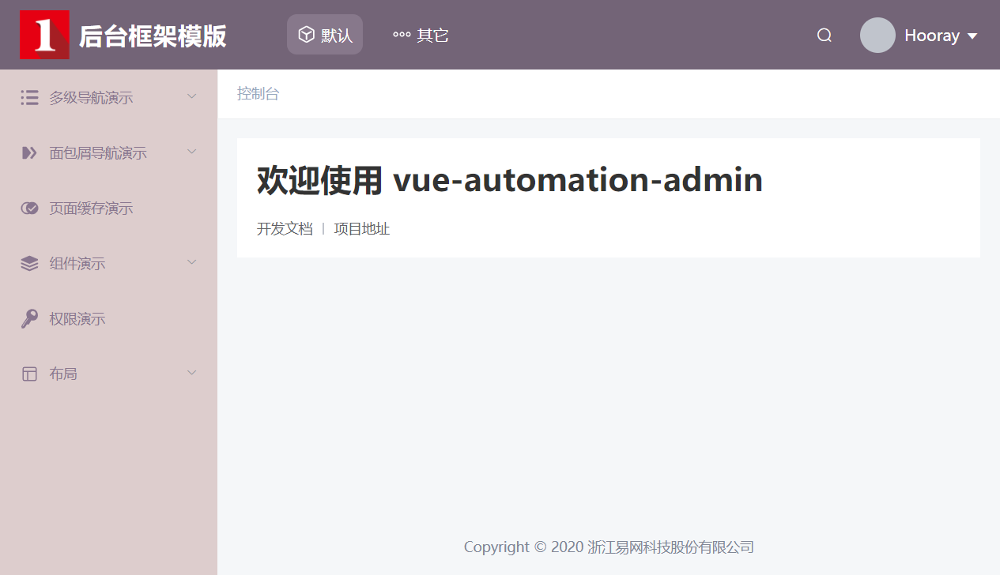
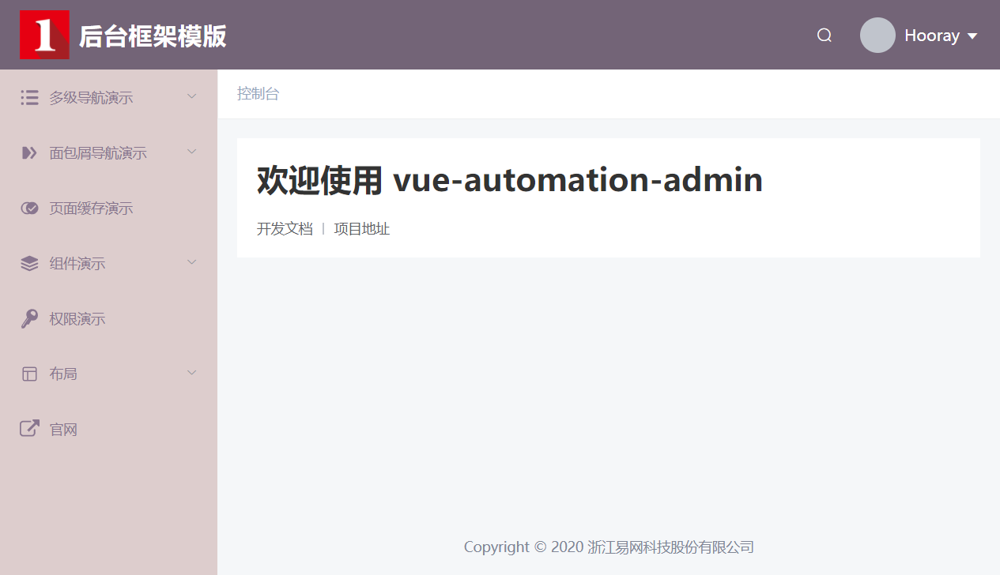

# 布局

布局提供了 3 种模式，覆盖市面上常见中后台布局。

## 侧边栏带主导航模式（默认）



项目运行后，就能看到如上效果，无需进行任何配置。

## 仅侧边栏模式



仅显示侧边栏，但不需要主导航，需要在 `src/router/index.js` 里设置 `asyncRoutes` ，当 `asyncRoutes` 的长度只有一项的时候，主导航则自动隐藏：

```js
let asyncRoutes = [
    {
        meta: {
            title: '默认',
            icon: 'sidebar-default'
        },
        children: [
            MultilevelMenuExample,
            BreadcrumbExample,
            KeepAliveExample,
            ComponentExample,
            PermissionExample,
            HeaderExample
        ]
    }
]
```

需要注意，如果 `asyncRoutes` 里有多项，但如果单项里的 `children` 为空，系统也不会算为多项。下面的配置主导航依旧自动隐藏：

```js
let asyncRoutes = [
    {
        meta: {
            title: '默认',
            icon: 'sidebar-default'
        },
        children: [
            MultilevelMenuExample,
            BreadcrumbExample,
            KeepAliveExample,
            ComponentExample,
            PermissionExample,
            HeaderExample
        ]
    },
    {
        meta: {
            title: '其它',
            icon: 'sidebar-other'
        },
        children: []
    }
]
```

## 头部导航模式



在 `src/setting.js` 里设置 `showHeader` 为 `true`：

```js
export default {
    // 是否显示头部
    showHeader: false
}
```

需要注意，如果没有主导航，则头部导航区域会留空，如下：


