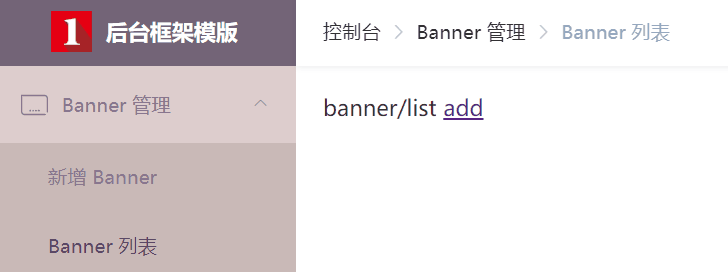
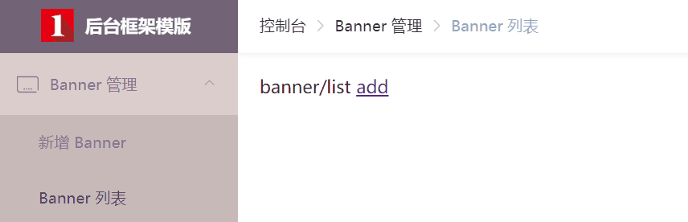

# 路由

> 请先阅读 vue-automation 的 [Vue-router](https://eoner.gitee.io/vue-automation/#/vue-router) 章节

## 配置项

本模版的核心是通过路由自动生成对应导航，所以除了路由的基本配置，还需要了解模版提供了哪些配置项：

```js
// 所有的特殊配置项均放在路由的 meta 对象中
meta: {
    // 该路由在侧边栏导航和面包屑导航中展示的标题
    title: '新闻列表',
    // 侧边栏导航中显示的图标
    icon: 'news',
    // 该路由进入的权限，支持多个权限叠加，只要满足一个，即可进入
    // 如果用户没有该权限，则该路由不会在侧边栏导航中展示
    auth: ['news.browse', 'news.edit'],
    // 该路由是否在侧边栏导航中展示，如编辑页面 /edit/:id ，默认为 true
    sidebar: false,
    // 该路由是否在面包屑导航中展示，默认为 true
    breadcrumb: false,
    // 当路由设置了该属性，则会高亮相对应的侧边栏，一般会搭配 sidebar: false 一起使用
    // 例如从新闻列表进入新闻详情页，由于新闻详情页路由不在侧边栏导航中展示，这时你如果想高亮新闻列表的路由，就可以进行如下设置
    activeMenu: '/news/list'
}
```

示例：

```js
import Layout from '@/layout'

export default {
    path: '/banner',
    component: Layout,
    redirect: '/banner/list',
    name: 'banner',
    meta: {
        title: 'Banner 管理',
        icon: 'banner',
        auth: ['banner.browse']
    },
    children: [
        {
            path: 'detail',
            name: 'bannerCreate',
            component: () => import(/* webpackChunkName: 'banner' */ '@/views/banner/detail'),
            meta: {
                title: '新增 Banner',
                auth: ['banner.create']
            }
        },
        {
            path: 'list',
            name: 'bannerList',
            component: () => import(/* webpackChunkName: 'banner' */ '@/views/banner/list'),
            meta: {
                title: 'Banner 列表',
                auth: ['banner.browse']
            }
        },
        {
            path: 'detail/:id',
            name: 'bannerEdit',
            component: () => import(/* webpackChunkName: 'banner' */ '@/views/banner/detail'),
            meta: {
                title: '编辑 Banner',
                auth: ['banner.edit'],
                sidebar: false,
                activeMenu: '/banner/list'
            }
        }
    ]
}
```

最终效果如下：



## 特殊技巧

客户总是有自己的想法，例如我司就遇到了这样的需求，在不改变侧边栏导航结构的前提下，面包屑导航希望能变成这样：



其实根据图中的效果，可以确定路由需要有三层，剩下就是通过配置项去控制侧边栏导航和面包屑导航是否展示。

```js
import Layout from '@/layout'

export default {
    path: '/banner',
    component: Layout,
    redirect: '/banner/list',
    name: 'banner',
    meta: {
        title: 'Banner 管理',
        icon: 'banner',
        auth: ['banner.browse']
    },
    children: [
        {
            path: 'detail',
            redirect: '/banner/list/detail',
            meta: {
                title: '新增 Banner',
                auth: ['banner.create']
            }
        },
        {
            path: 'list',
            name: 'bannerList',
            component: { render: h => h('router-view') },
            redirect: '/banner/list',
            meta: {
                title: 'Banner 列表',
                auth: ['banner.browse']
            },
            children: [
                {
                    path: 'detail',
                    name: 'bannerCreate',
                    component: () => import(/* webpackChunkName: 'banner' */ '@/views/banner/detail'),
                    meta: {
                        title: '新增 Banner',
                        auth: ['banner.create'],
                        sidebar: false,
                        activeMenu: '/banner/detail'
                    }
                },
                {
                    path: '',
                    name: 'bannerList',
                    component: () => import(/* webpackChunkName: 'banner' */ '@/views/banner/list'),
                    meta: {
                        title: 'Banner 列表',
                        auth: ['banner.browse'],
                        sidebar: false,
                        breadcrumb: false
                    }
                },
                {
                    path: 'detail/:id',
                    name: 'bannerEdit',
                    component: () => import(/* webpackChunkName: 'banner' */ '@/views/banner/detail'),
                    meta: {
                        title: '编辑 Banner',
                        auth: ['banner.edit'],
                        sidebar: false,
                        activeMenu: '/banner/list'
                    }
                }
            ]
        }
    ]
}
```

> 这个需求其实在学习 vue-element-admin 就想到过，也给作者提过 issue ([#1426](https://github.com/PanJiaChen/vue-element-admin/issues/1426))，不过作者并没给我更好的解决方案，so sad~
